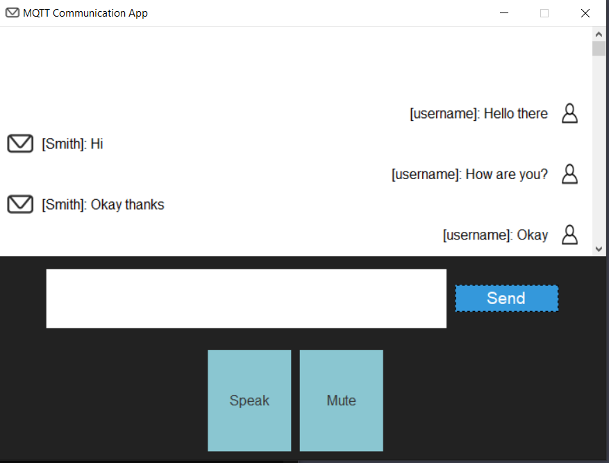

MQTT Communication App
======================

A simple GUI-based MQTT communication application using Python and Tkinter that enables users to send and receive text and voice messages in real-time. The application displays messages allows users to mute incoming voice messages and view the number of unheard messages.

Features
--------

*   Real-time text and voice messaging
*   Mute/unmute functionality for incoming voice messages
*   Display of the number of unheard messages
*   Tkinter-based user-friendly interface

Requirements
------------

*   Python 3.x
*   Tkinter
*   paho-mqtt
*   speech\_recognition
*   pyttsx3
*   Pillow
*   Mosquitto MQTT broker

Installation
------------

1.  Install the required Python libraries:

    pip install paho-mqtt speechrecognition pyttsx3 Pillow
    

2.  Install the PyAudio library for microphone support:

    pip install pyaudio
    

For platform-specific installation instructions, refer to the [PyAudio documentation](https://people.csail.mit.edu/hubert/pyaudio/).

3.  Install and configure the [Mosquitto MQTT broker](https://mosquitto.org/).
4.  Place the person icon ('person.jpg') and the application icon ('icon.png') in the script's working directory.

Usage
-----

Run the script `main.py`:

    python main.py
    

The application will launch, and you can start sending and receiving messages using the GUI.
