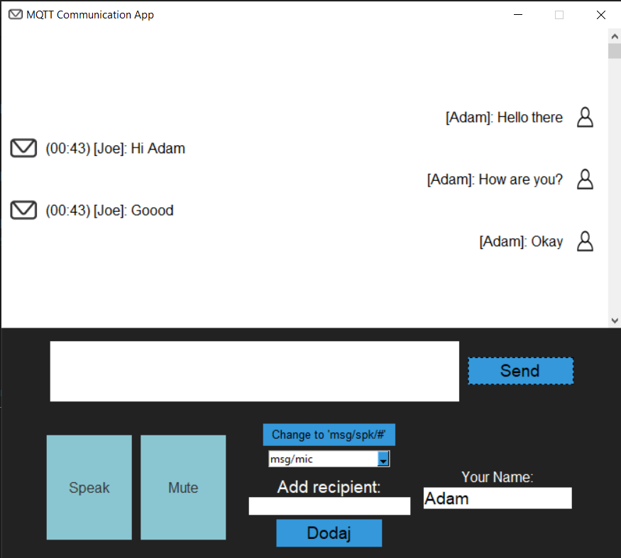

MQTT Communication App
======================

A simple GUI-based MQTT communication application using Python and Tkinter that enables users to send and receive text and voice messages in real-time. The application displays messages allows users to mute incoming voice messages and view the number of unheard messages.



Features
--------

*   Real-time text and voice messaging
*   Mute/unmute functionality for incoming voice messages
*   Display of the number of unheard messages
*   Tkinter-based user-friendly interface

### Mute and Unmute functionality

When the application is muted, it will queue all incoming messages along with their timestamps. Once the mute button is toggled off, the application will play and display all the queued messages in the main window along with the sender's ID and the timestamp of when the message was received. This feature ensures that users can catch up on the messages they might have missed while the application was muted.

### Microphone functionality
When the "Speak" button is clicked, the application starts listening for voice input. As the user speaks, the microphone remains active and listening. Once the user stops speaking and there is a pause in speech, the voice message is sent automatically. The microphone will continue to listen for subsequent voice messages without the need to click the "Speak" button again.

To stop listening and deactivate the microphone, click "Turn off". This will toggle the microphone off, and the button will return to its original state.

Requirements
------------

*   Python 3.x
*   Tkinter
*   paho-mqtt
*   speech\_recognition
*   pyttsx3
*   Pillow
*   Mosquitto MQTT broker

Installation
------------

1.  Install the required Python libraries:

   ``` pip install paho-mqtt speechrecognition pyttsx3 Pillow pyaudio ```
        

For platform-specific installation instructions, refer to the [PyAudio documentation](https://people.csail.mit.edu/hubert/pyaudio/).

3.  Install and configure the [Mosquitto MQTT broker](https://mosquitto.org/).

Usage
-----

Run the script `main.py`:

    ```python main.py```

## MQTT Topics

To properly use the MQTT Communication App, make sure to subscribe to the correct topic and send messages to the appropriate topic:

1. Run `mosquitto_sub` to subscribe to the topic "msg/mic":


``` mosquitto_sub -h localhost -t "msg/mic" ```

2. To send messages to the application, publish them to the topic "msg/spk". You can do this using mosquitto_pub:


``` mosquitto_pub -h localhost -t "msg/spk" -m "your_nick|your_message_here" ```


    

The application will launch, and you can start sending and receiving messages using the GUI.
